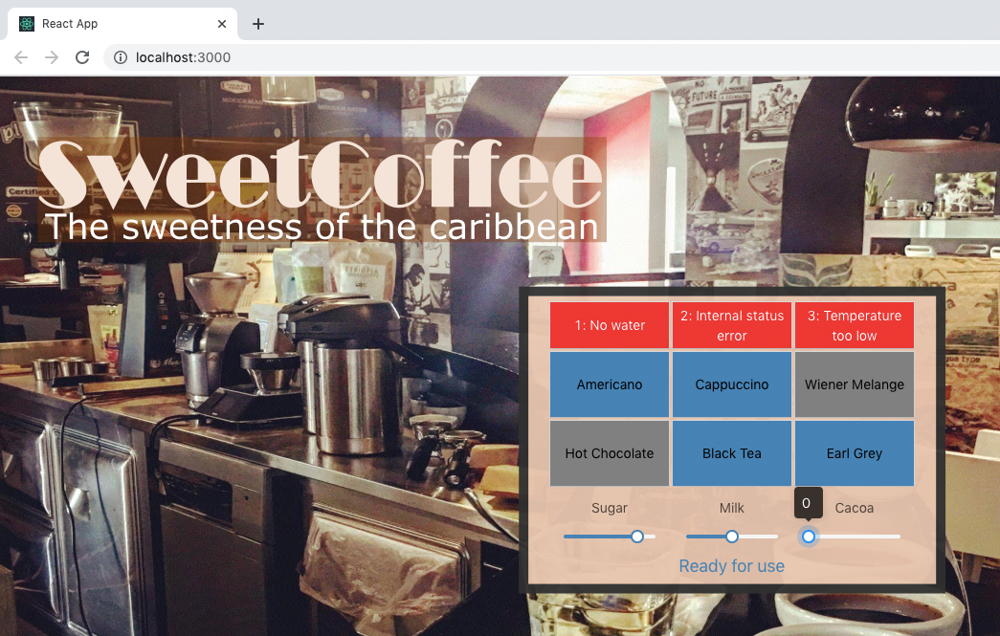

# coffee-interface
A small project where I created an interface for a coffee machine, in order to play around with React. 
This project was bootstrapped with [Create React App](https://github.com/facebook/create-react-app).

###### Install notes:
This app utilizes the [Ant Design](https://www.npmjs.com/package/antd) React UI library. 
Install the library with `npm install antd`

Enzyme is a JavaScript Testing utility for React that makes it easier to assert, manipulate, and traverse your React Components’ output, in addition to Jest.  
Install Enzyme with `npm install --save-dev enzyme enzyme-adapter-react-16 enzyme-to-json`

###### Execute the app:
Execute the app by navigating to the project directory with your terminal and enter the command `npm start` 
Open [http://localhost:3000](http://localhost:3000) to view it in the browser.

